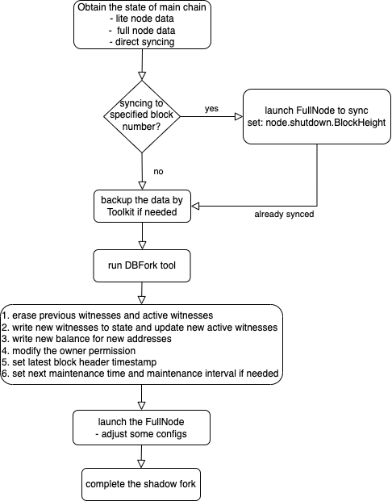

## Database Fork Tool
Database fork tool can help launch a private java-tron FullNode or network based on the state of public chain database to support shadow fork testing.
The public chain database can come from the Mainnet, Nile or Shasta testnet.

Database fork tool provides the ability to modify the witnesses and other related data in the database to
implement shadow fork testing, which includes:
- Erase the historical witnesses and active witnesses
- Write new witnesses to the state and update new active witnesses
- Write new balance for new addresses
- Modify the owner permission of existing account to simulate the account operation
- Modify the TRC10 and TRC20 balances
- Set the new `latesteBlockHeaderTimestamp` to avoid the delay in producing blocks
- Set the new `maintenanceTimeInterval` and `nextMaintenanceTime` optionally to facilitate testing

After launching the shadow fork FullNode or network,
developers can connect and interact with the node by [wallet-cli](https://tronprotocol.github.io/documentation-en/clients/wallet-cli/),
[TronBox](https://developers.tron.network/reference/what-is-tronbox), [Tron-IDE](https://developers.tron.network/docs/tron-ide) or other tools, and execute the shadow fork testing.

The whole procedure of shadow fork is described in the following figure:



### Obtain the state data
To use the DBFork tool, we need to obtain the state data of the public chain first. There are three possible ways:

- Download the [Lite FullNode](https://tronprotocol.github.io/documentation-en/using_javatron/backup_restore/#lite-fullnode-data-snapshot) data snapshot;

- Download the [Full Node](https://tronprotocol.github.io/documentation-en/using_javatron/backup_restore/#fullnode-data-snapshot) data snapshot;

- Launch the FullNode and sync directly.

If we want the state data of specified block height, we can modify the `node.shutdown.BlockHeight` option in the [config](https://github.com/tronprotocol/tron-deployment/blob/master/main_net_config.conf) to make the FullNode sync to the target height after downloading the snapshot.
```conf
node.shutdown = {
#  BlockTime  = "54 59 08 * * ?" # if block header time in persistent db matched.
   BlockHeight = 33350800 # if block header height in persistent db matched.
#  BlockCount = 12 # block sync count after node start.
}
```

Please refer [Startup a fullnode](https://tronprotocol.github.io/documentation-en/using_javatron/installing_javatron/#startup-a-fullnode) to launch the FullNode and sync to the specified block number. The FullNode will halt when it syncs to the target block height.

**Note**: `node.shutdown.BlockHeight` is the solidified block height. You can use the `/wallet/getnowblock` api to check the latest block height, which should be `node.shutdown.BlockHeight + 20` when the FullNode halts.

If you need to perform multiple shadow fork tests, you'd better backup the `output-directory` using the [Toolkit data copy](https://tronprotocol.github.io/documentation-en/using_javatron/toolkit/#data-copy) tool.
```shell
java -jar Toolkit.jar db copy output-directory output-directory-bak
```

### Run the DBFork tool
Run the DBFork tool in the Toolkit to modify the related data. The available parameters are:
- `-c | --config=<config>`: config the new witnesses, balances, etc for shadow
  fork. Default: fork.conf
- `-d | --database-directory=<database>`: java-tron database directory path. Default: output-directory
- `-h | --help`
- `-r | --retain-witnesses`: retain the previous witnesses and active witnesses. Default: false

The example of `fork.conf` can be:

```conf
witnesses = [
  {
    address = "TS1hu4ZCcwBFYpQqUGoWy1GWBzamqxiT5W"
    url = "http://meme5.com"
    voteCount = 100000036
  },
  {
    address = "TRY18iTFy6p8yhWiCt1dhd2gz2c15ungq3"
    voteCount = 100000035
  }
]

accounts = [
  {
    address = "TS1hu4ZCcwBFYpQqUGoWy1GWBzamqxiT5W"
    accountName = "Meme"
    balance = 99000000000000000
  },
  {
    address = "TRY18iTFy6p8yhWiCt1dhd2gz2c15ungq3"
    accountType = "Normal"
    balance = 99000000000000000
  },
  {
    address = "TLLM21wteSPs4hKjbxgmH1L6poyMjeTbHm"
    owner = "TS1hu4ZCcwBFYpQqUGoWy1GWBzamqxiT5W"
  },
  {
    address = "TRY18iTFy6p8yhWiCt1dhd2gz2c15ungq3"
    trc10Id = "1000001"
    trc10Balance = 100000000
  }
]

trc20Contracts = [
  {
    contractAddress = "TR7NHqjeKQxGTCi8q8ZY4pL8otSzgjLj6t"
    balancesSlotPosition = 0
    address = "TRY18iTFy6p8yhWiCt1dhd2gz2c15ungq3"
    balance = "98800000000000000"
  },
  {
    contractAddress = "TSSMHYeV2uE9qYH95DqyoCuNCzEL1NvU3S"
    balancesSlotPosition = 0
    address = "TRY18iTFy6p8yhWiCt1dhd2gz2c15ungq3"
    balance = "128745186062510400000000000"
  }
]

latestBlockHeaderTimestamp = 1735628883000
maintenanceTimeInterval = 21600000
nextMaintenanceTime = 1735628894000
```

For the `witnesses`, we can configure the following properties:
- `address`: add the new witness address
- `url`: set the URL of the new witness
- `voteCount`: set the vote count of the witness

For the `accounts`, we can configure the following properties:
- `address`:  add or modify the account address
- `accountName`: set the name of the account
- `accountType`: set the account type, namely `Normal`, `AssetIssue` and `Contract`
- `balance`: set the balance of the account
- `owner`: set the owner permission of the account
- `trc10Id`: the TRC10 token ID
- `trc10Balance`: change the balance of `trc10Id`

*Note*: If you need to add new address, you can use the [tronlink](https://www.tronlink.org/) or [wallet-cli](https://github.com/tronprotocol/wallet-cli?tab=readme-ov-file#account-related-commands) to genrate the private key and address.

For the `trc20Contracts`, we can configure the following properties:
- `contractAddress`: set the TRC20 contract address
- `balancesSlotPosition`: set the `balances` slot position in the TRC20 contract storage layout
- `address`: set the account address
- `balance`: set the TRC20 balance

*Note*: the `balancesSlotPosition` sets slot position for
`mapping(address account => uint256) private _balances` variable in the TRC20 contract.
For most standard TRC20 contracts, the `balancesSlotPosition` is 0. For some special cases,
you may need to change the `balancesSlotPosition` value. For more details about the variable slot position
in the contract, please refer [layout_in_storage](https://docs.soliditylang.org/en/latest/internals/layout_in_storage.html).

set `latestBlockHeaderTimestamp` as current millisecond time to avoid the delay in producing blocks.

set `maintenanceTimeInterval` and `nextMaintenanceTime` optionally to facilitate testing.

Execute the fork command:
```shell script
java -jar Toolkit.jar db fork -c /path/to/fork.conf -d /path/to/output-directory
```

### Launch the FullNode
Launch the FullNode against the modified state. To launch the node smoothly, we may need to change some parameters in the [config](https://github.com/tronprotocol/tron-deployment/blob/master/main_net_config.conf):
```config
needSyncCheck = false
minParticipationRate = 0
minEffectiveConnection = 0
node.p2p.version = 202501 // arbitrary number except for 11111(Mainnet) and 20180622(Nile testnet)
```
*Note*: please remember to comment `node.shutdown.BlockHeight` in the config if you have modified it previously.

To isolate from the Mainnet and other testnets, The `node.p2p.version` can be arbitrary number different from the Mainnet and other testnets.

To produce the blocks, we also need to configure the private keys of the witness addresses in the config and run the FullNode with the `--witness` parameter, please refer [startup a fullnode that produces blocks](https://tronprotocol.github.io/documentation-en/using_javatron/installing_javatron/#startup-a-fullnode-that-produces-blocks).
```config
localwitness = [
]
```

If another node wants to join the shadow fork network, it needs to execute the above steps, or it copies the state data from the first shadow fork node directly. They need to configure the same `node.p2p.version` and add the `seed.node` in the config, then they can sync and produce blocks to form a local testnet.

At last, developers can connect and interact with the node by [wallet-cli](https://tronprotocol.github.io/documentation-en/clients/wallet-cli/),
[TronBox](https://developers.tron.network/reference/what-is-tronbox), [Tron-IDE](https://developers.tron.network/docs/tron-ide) or other tools, and execute the shadow fork testing.
